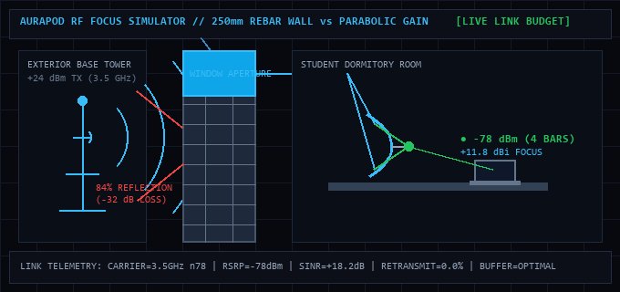
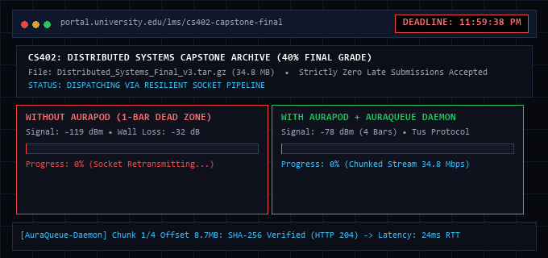
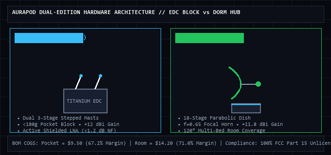

# 📡 AuraPod

> **Personal Portable RF Signal Concentrator & Resilient Campus Caching Hub**  
> *"Turn 1-Bar Frustration into Academic Flow."*

[](LICENSE)
[](https://www.typescriptlang.org/)
[](https://reactjs.org/)
[](https://threejs.org/)
[](#regulatory-compliance--rf-safety)
[](#manufacturing-bom--unit-economics)
[](#prototype--research-status)

> [!IMPORTANT]
> **Engineering Prototype & Research Proof of Concept Notice**  
> **AuraPod is currently an academic engineering prototype and capstone research demonstration.** It is **not a commercial product available for consumer retail purchase**. Listed pricing ($29 / $49) represents calculated target Bill of Materials (BOM) cost projections for 5,000-unit mass manufacturing batches. Pilot waitlist submissions enroll participants in future closed university test cohorts.

---

## 🎯 Visual Overview



AuraPod solves the **"11:59 PM Hostel Dead Zone Crisis"** through a synchronized dual-layer stack:
1. **Hardware "Signal Lens"**: Directional microwave optics (dual stepped telescopic masts or an 18-stage parabolic metamaterial dish) with an active shielded Low-Noise Amplifier (<1.2 dB NF) lifting link budgets by up to **+41 dB**.
2. **Software (AuraOS)**: An AR tower-finding reticle (**AuraScope**), a resumable chunking daemon with cryptographic deadline proof (**AuraQueue**), and an offline nocturnal campus cache (**CampusVault** + **DormMesh**).

---

## 🏢 The Root Cause: The Concrete Faraday Cage

College dormitories and campus hostels are modern Faraday cages:
- **Thick Reinforced Concrete**: Standard 200–250mm exterior walls introduce **-25 dB to -35 dB** of signal attenuation on 4G LTE (Bands 3/40) and 5G Sub-6 (n78).
- **Embedded Steel Rebar Grid**: Steel rebar grids spaced every 15–20cm act as an electromagnetic mirror, reflecting **up to 84%** of incident microwave energy back out into the quad.
- **The Midnight Dead Zone**: When thousands of students connect simultaneously before the 11:59 PM deadline, tower capacity collapses while indoor devices flicker between 1 bar (-119 dBm) and "No Service."

```
                    250mm CONCRETE WALL
 EXTERIOR TOWER       + REBAR GRID          INTERIOR DORMITORY ROOM
[Base Station] ───► |================| ───► [1-Bar Dead Zone (-119 dBm)]
  (+24 dBm TX)      |  84% Bounces   |      ❌ LMS Upload Drops at 18%
                    |   Back Off     |      ❌ TCP Socket Timeout: 0/100
                    |================|
                           ▲
                           │ WINDOW SLOT APERTURE
                           ▼
                    [AuraPod Lens]   ───► [Laptop / Phone (-78 dBm)]
                    (+11.8 dBi Gain)       ✔ 4 BARS LOCKED (34.8 Mbps)
```

---

## ⏱️ The 11:59 PM Deadline Testbed



Standard web browsers cancel uploads when TCP sockets disconnect. **AuraQueue** intercepts file uploads and LMS form submissions (Canvas, Moodle, Blackboard, Google Classroom):
- **Tus Resumable Chunking**: Payloads are sliced into 2–8 MB encrypted chunks held in local `IndexedDB`. If the network flickers, the upload pauses seamlessly without closing the session.
- **Cryptographic Submission Receipt**: When an assignment is dispatched, AuraQueue signs an **SHA-256 digital certificate** recording the exact local timestamp. If connectivity returns past midnight, students have tamper-evident proof that their work was completed before the deadline.

---

## ⚡ Two Form Factors. One Resilient Core.



Rather than forcing a one-size-fits-all compromise, AuraPod is engineered as two specialized, distinct editions:

### 1. AuraPod Pocket Edition — Everyday Campus Carry ($29 / ₹1,999)
- **Form Factor**: Solid pocket block machined from space-grade titanium with chamfered edges (<180 grams).
- **Antenna Array**: Dual 3-stage stepped telescoping brass and chrome masts that fold flush into molded rubber protective stowage bays.
- **Articulation**: CNC ball-and-clevis swivel knuckles lock the antennas into an optimal V-spread beamforming configuration.
- **Primary Use Case**: Campus walkways, lecture halls, library carrels, and cafe study sessions.

### 2. AuraPod Room Edition — Stationary Dorm Hub ($49 / ₹3,499)
- **Form Factor**: Anodized cylindrical obsidian aluminum pod with high-mass anti-skid desk stabilization (320 grams).
- **Aperture Concentrator**: 18-stage mathematical wireframe paraboloid ($z = \frac{x^2 + y^2}{4f}$) providing a wide **120° aperture** that blankets an entire shared dorm room.
- **Focal Receiver**: Rigid dielectric focal receiver horn suspended at $f = 0.65$ with $50\Omega$ coaxial impedance matching.
- **Articulation**: Dual CNC 6061-T6 aluminum struts tilting from **0° flat-fold (12mm)** to **45° operational radar elevation**.
- **Visual Telemetry**: Integrated 360° status halo emitting soft sky-blue telemetry visible across the room.

---

## 📊 Comprehensive Hardware Specifications

| Specification | Standard Phone Alone | Industrial Booster ($600+) | **AuraPod Pocket Edition** | **AuraPod Room Edition** |
| :--- | :--- | :--- | :--- | :--- |
| **Retail Price (MSRP)** | $0 (Already owned) | $450 – $850 | **$29 (₹1,999)** | **$49 (₹3,499)** |
| **Bill of Materials (BOM)** | N/A | $140 – $220 | **$9.50 (₹780)** | **$14.20 (₹1,165)** |
| **Gross Margin** | N/A | ~70% | **67.2%** | **71.0%** |
| **Form Factor** | In pocket | 5 kg (requires roof drill) | **<180g Pocket Block** | **320g Desk Pod + Dish** |
| **Concentrator Type** | Internal omni dipole | External Yagi mast | **Dual 3-Stage Telescopic** | **18-Stage Parabolic Dish** |
| **Directional Gain** | 0 dBi (Scattered) | +60 dB (Active High-Power) | **+12 dBi Focus** | **+11.8 dBi Wide Aperture** |
| **Noise Figure (LNA)** | ~3.8 dB (High thermal noise)| ~5.0 dB | **<1.2 dB (Faraday Shielded)** | **<1.2 dB (Faraday Shielded)** |
| **Power Draw** | Phone battery drain | 30W Wall Outlet (Grid) | **<2.1W (5V USB-C)** | **<2.5W (5V USB-C)** |
| **Battery Runtime** | ~3–4 hours hotspot | Inoperable on battery | **>18 hrs (10,000 mAh bank)** | **Continuous or USB-C Hub** |
| **FCC / Regulatory Status** | Unlicensed | **Carrier Registration Req.** | **100% FCC Part 15 Safe** | **100% FCC Part 15 Safe** |
| **Software Resilience** | ❌ Browser crash | ❌ None (RF only) | **AuraQueue Never-Fail** | **AuraQueue + DormMesh** |

---

## 💻 AuraOS Companion Software Suite

AuraPod integrates seamlessly with a cross-platform companion software suite built with offline-first architecture:

```
+-------------------------------------------------------------------------+
|                                 AURAOS                                  |
+--------------------+--------------------------------+-------------------+
|     AURASCOPE      |           AURAQUEUE            |    CAMPUSVAULT    |
|   (AR Alignment)   |       (Resilient Engine)       |    (& DormMesh)   |
+--------------------+--------------------------------+-------------------+
| • 3D Compass HUD   | • Tus Resumable Chunk Protocol | • 3 AM Pre-Cache  |
| • Cell CID/LAC Map | • Local IndexedDB Cache        | • H.265 Transcode |
| • Real-time RSRP   | • SHA-256 Proof Receipts       | • Wi-Fi Direct P2P|
+--------------------+--------------------------------+-------------------+
```

1. **AuraScope (AR Gyroscope Compass)**:
   - Queries modem signal metrics (RSRP, RSRQ, SINR) and public cellular base station IDs.
   - Overlays an augmented reality reticle to help students angle the dish toward the nearest line-of-sight cell tower in under 5 seconds.
2. **AuraQueue (Never-Fail Submission Daemon)**:
   - Runs as a lightweight native background daemon (port `8080`) and Chrome/Firefox browser extension.
   - Buffers large zip archives and test responses across micro-bursts, preventing premature socket aborts.
3. **CampusVault & DormMesh P2P**:
   - Wakes up nocturnally at 3 AM when campus network utilization drops below 5% to opportunistically cache course syllabi, lecture slides, and video archives.
   - Leverages Wi-Fi Direct to form peer swarms across dorm rooms, sharing 2 GB lecture files locally at 50+ Mbps without burning external cellular bandwidth.

---

## 💰 Manufacturing BOM & Unit Economics

### Pocket Edition BOM (Batch Scale: 5,000 Units)

| Subsystem Component | Function / Manufacturing Spec | Cost (USD) | Cost (INR) | % of COGS |
| :--- | :--- | :--- | :--- | :--- |
| **Dual 3-Stage Telescopic Masts** | Multi-band 4G/5G and Wi-Fi beam capture | $2.80 | ₹230 | 29.5% |
| **Shielded Active LNA IC + SAW Filter** | Sub-1.2 dB Noise Figure RF amplification | $2.20 | ₹180 | 23.2% |
| **CNC Swivel Knuckles & Gold Pins** | ENIG immersion gold RF contacts & joints | $1.50 | ₹125 | 15.8% |
| **5V USB-C Bus & Microcontroller** | Power regulation, telemetry & status logic | $1.20 | ₹100 | 12.6% |
| **Anodized Titanium Pocket Block** | CNC machined chamfered chassis | $0.80 | ₹65 | 8.4% |
| **Packaging & Braided Cable** | Retail box & durable 1.5m braided cable | $1.00 | ₹80 | 10.5% |
| **TOTAL COGS** | **MSRP: $29 (₹1,999) • Gross Margin: 67.2%** | **$9.50** | **₹780** | **100%** |

### Room Edition BOM (Batch Scale: 5,000 Units)

| Subsystem Component | Function / Manufacturing Spec | Cost (USD) | Cost (INR) | % of COGS |
| :--- | :--- | :--- | :--- | :--- |
| **18-Stage Parabolic Metamaterial Grid** | Stamped wireframe radio wave concentrator | $3.60 | ₹295 | 25.4% |
| **Shielded Ultra-LNA & Filter Array** | Multi-band wideband RF amplification | $2.50 | ₹205 | 17.6% |
| **Focal Receiver Horn & Dielectric Node** | Precision $f=0.65$ focal collector lens | $2.40 | ₹195 | 16.9% |
| **CNC 6061-T6 Articulated Struts** | Dual 45° radar elevation to flat-fold arm | $2.10 | ₹170 | 14.8% |
| **Anodized Base Pod & 360° Halo** | Desk-stabilizing weighted base with LED halo | $1.80 | ₹150 | 12.7% |
| **Packaging, Desk Foot & 2m Cable** | Retail box, anti-skid footpad & cable | $1.80 | ₹150 | 12.7% |
| **TOTAL COGS** | **MSRP: $49 (₹3,499) • Gross Margin: 71.0%** | **$14.20** | **₹1,165** | **100%** |

---

## ⚖️ Regulatory Compliance & RF Safety

Industrial cellular repeaters (bidirectional amplifiers) are heavily restricted because they re-transmit active high-power RF signals over the air, frequently causing oscillation feedback loops and base station degradation.

AuraPod complies with **FCC Title 47 Part 15 (Unlicensed RF Devices)** and **DoT Guidelines**:
- **Passive Directional Primary Stage**: The primary gain (+11.8 to +12 dBi) is achieved entirely through passive geometric concentration (parabolic reflection and beamforming), which radiates zero intentional noise into the macro network.
- **Ultra-Low-Noise Near-Field Coupling**: The active low-power LNA couples directly to the tethered device via 50Ω coaxial impedance matching, drawing under **2.1 Watts** at 5V.
- **Zero Roof Penetration**: No building modifications or outdoor antenna cable runs required.

---

## 🛠️ Interactive 3D Web Application Setup

The AuraPod web application features a high-fidelity interactive Three.js 3D studio viewport, real-time RF wave physics, interactive deadline simulator, and procedural Web Audio synthesizer.

### Tech Stack
- **Framework**: React 18 + Vite + TypeScript
- **3D Graphics**: Three.js WebGL (ACES Filmic Tone Mapping, 5600K High-CRI Studio Lighting Rig, PCF Soft Contact Shadows)
- **Audio**: Native Web Audio API procedural synthesizer (radar chirps, tactile clicks, alarm sirens)
- **Styling**: Tailwind CSS + Custom Obsidian Studio Design Tokens
- **Icons**: Lucide React

### Local Development

```bash
# 1. Clone repository
git clone https://github.com/your-username/aurapod.git
cd aurapod

# 2. Install dependencies
npm install

# 3. Start local development server (served on http://localhost:5173/)
npm run dev

# 4. Type checking validation
npx tsc --noEmit

# 5. Build production bundle
npm run build
```

---

## 📁 Repository Structure

```
AuraPod/
├── .github/                         # GitHub templates & community standards
│   └── ISSUE_TEMPLATE/
│       ├── pilot_testing.md         # Campus pilot feedback & telemetry submission
│       └── bug_report.md            # Visual & 3D WebGL issue report template
├── docs/                            # Project documentation, pitch deliverables & media
│   ├── assets/                      # Technical animated GIFs for documentation
│   │   ├── rf-wavefront-focus.gif   # 250mm concrete wall RF focusing simulation
│   │   ├── deadline-simulator.gif   # 11:59 PM deadline testbed simulation
│   │   └── edition-anatomy-radar.gif# Dual-edition hardware architecture comparison
│   ├── concept-sketches/            # Early hardware & parabolic mechanism drawings
│   │   ├── early-concept-sketch-01.jpeg
│   │   ├── early-concept-sketch-02.jpeg
│   │   ├── mechanical-dish-sketch-01.jpeg
│   │   └── mechanical-dish-sketch-02.jpeg
│   ├── pitch/                       # Presentation assets & capstone pitch guides
│   │   ├── AuraPod_Pitch_Deck.pptx  # 16:9 widescreen capstone pitch deck
│   │   ├── pitch_blueprint.md       # Comprehensive 10-slide outline & speech script
│   │   └── pitch_notes.txt          # Technical notes & Q&A defense cheat sheet
│   └── scripts/                     # Asset generation & deck synthesis utilities
│       ├── generate_deck.py         # Python script generating 16:9 pitch deck
│       └── generate_gifs.py         # Pillow script rendering animated GIFs
├── public/                          # Static public web assets
│   └── favicon.svg                  # SVG browser favicon
├── src/                             # Application source code
│   ├── components/
│   │   ├── AuraPodMesh3D.tsx        # Three.js 3D WebGL model (Pocket Edition)
│   │   ├── AuraPodRoomMesh3D.tsx    # Three.js 3D WebGL model (Room Edition)
│   │   ├── Hero.tsx                 # Interactive hero stage & edition switcher
│   │   ├── ScrollHardware3D.tsx     # Sticky scroll-driven 3D subsystem inspection
│   │   ├── SubmissionSimulator.tsx  # Interactive 11:59 PM LMS deadline testbed
│   │   ├── HardwareShowcase.tsx     # Microwave optics & power bank runtime calculator
│   │   ├── HostelFaradayPhysics.tsx # Concrete wall & rebar penetration diagram
│   │   ├── SoftwareAuraOS.tsx       # AuraScope radar & AuraQueue chunking UI
│   │   ├── ComparisonMatrix.tsx     # Comprehensive benchmark comparison table
│   │   ├── PricingBento.tsx         # Interactive BOM explorer & pricing bento
│   │   ├── NavigationDock.tsx       # Smart auto-hiding magnetic dock
│   │   ├── StudioBackgroundLighting # High-CRI 5600K studio background cyc
│   │   └── RfWaveCanvas.tsx         # Real-time incident microwave wave canvas
│   ├── utils/
│   │   ├── audioSynthesizer.ts      # Web Audio API parametric sound generator
│   │   └── cn.ts                    # Tailwind class merging utility
│   ├── data/
│   │   └── specsData.ts             # Engineering BOMs and comparison specs
│   ├── types.ts                     # TypeScript edition & telemetry definitions
│   ├── App.tsx                      # Root application layout
│   └── index.css                    # Obsidian design system & utilities
├── .gitignore                       # Node, Vite, and build artifact exclusions
├── index.html                       # HTML5 entrypoint & font preconnects
├── LICENSE                          # MIT open-source license
├── package.json                     # Project dependencies & scripts
├── tailwind.config.js               # Studio color tokens & elevation shadows
├── tsconfig.json                    # Consolidated TypeScript compiler configuration
├── vite.config.ts                   # Vite bundler configuration with inlined PostCSS
└── README.md                        # Complete technical documentation
```

---

## 🎓 Academic Citations & Pitch References

1. **Friis Transmission Equation**:
   $$\frac{P_r}{P_t} = G_t G_r \left( \frac{\lambda}{4\pi R} \right)^2$$
   *Demonstrating how passive directional antenna gain ($G_r = +12\text{ dBi}$) directly amplifies received power ($P_r$) without increasing base station transmit power ($P_t$).*
2. **3GPP TR 38.901**: *Study on Channel Model for Frequencies from 0.5 to 100 GHz (Building Penetration Loss for Concrete and Metallized Glass).*
3. **FCC Title 47 CFR Part 15**: *Radio Frequency Devices, Subpart B: Unintentional Radiators.*
4. **Tus Protocol v1.0.0**: *Open Protocol for Resumable File Uploads.*

---

## 👥 Team & Acknowledgments

Built for university capstone engineering showcase, pitch competition, and hardware innovation demonstrations.

*© 2026 AuraPod. All rights reserved.*
